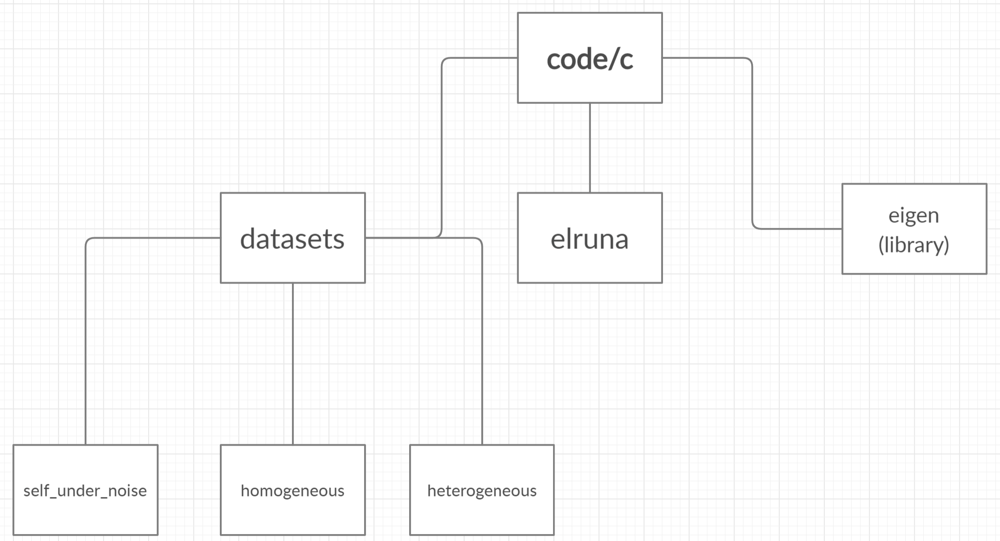

# **ELRUNA** : **EL**imination **RU**le-based **N**etwork **A**lignment

**Parameters:**
1. *.edges* file of G1
2. *.edges* file of G2 (**please make sure $|V_1| <= |V_2|$**)
3. number  of iterations (recommend to set to the larger diameter of the networks)
4. [optional] (0/1) flag indicates which alignment method to use
    - 0:  naive alignment
    - 1: (default) seed alignment
 
**File structure**


All network files can be found under the directory `datasets`.  

**G1:** Given a network G1, its name has the format: *name_g1.edges*, for example: *erdos_g1.edges*.

**G2:** G2 is created upon G1 by adding *p* faction of additional edges. Names of G2s has the format: *name_p_g2.edges*, for example: *erdos_0.25_g2.edges*.

**Run the alignment algorithm:**
```
cd code/c
g++ -std=c++11 -O3 elruna.cpp -o elruna
./elruna name_of_the_first_network name_of_the_second_network diameter [0/1]
```

**Example (using the seed alignment method):**
```
./elruna ../datasets/real_network/erdos/erdos_g1.edges datasets/real_network/erdos/erdos_0.25_g2.edges 14
```


**Example (using the naive alignment method):**
```
./elruna ../datasets/real_network/econ/econ_g1.edges datasets/real_network/econ/econ_0.25_g2.edges 8 0
```
